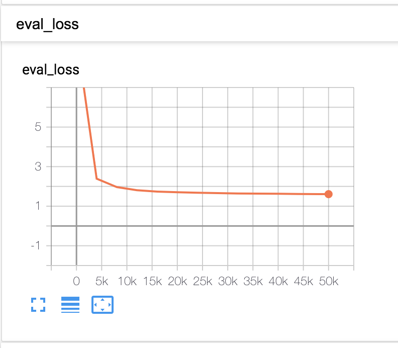
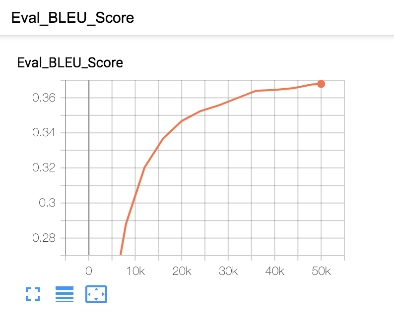
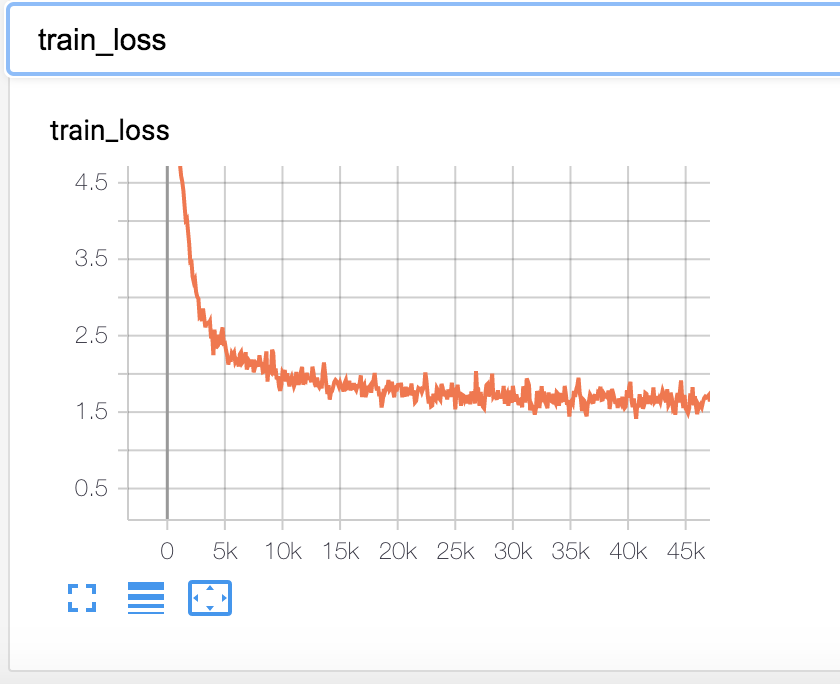
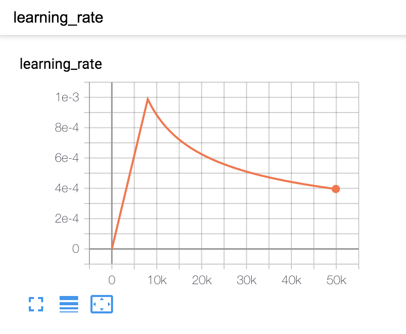

Neha Kumar  
MIDS W251 Section 1

TensorFlow Screenshots   

1. How long does it take to complete the training run?  
A: The training run takes almost a full 24 hours to complete, with 1.692s per step and 36872.646 objects per second. The first step started at 24/Jun/2020 15:08:57 UTC and the job completed at 25/Jun/2020 14:36:19 UTC 
2. Do you think your model is fully trained? How can you tell?  
A: I think the model was fully trained as the loss on the validation set was flattening out and the Eval BLEU score was also beginning to plateau.
3. Were you overfitting?  
A: No I do not think we overfit the model because the loss on the training and the validation datasets are roughly the same. If the training loss were much lower than the validation, that would suggest overfitting (but this is not the case).

4. Were your GPUs fully utilized?  
A: Yes, according to the nvidia-smi output, both GPUs on both VMs (4 total) were 100% utilized

5. Did you monitor network traffic (hint: apt install nmon)? Was network the bottleneck?  
A: The network speed is about 200k KB/s. The network is able to pass through up to 1 gbps. Therefore, the network is not being fully utilized so it is not the bottleneck

6. Take a look at the plot of the learning rate and then check the config file. Can you explan this setting?  
A: The learning rate goes up linearly up to the 8000th step (this is the warm-up rate) and then decreases proportionally to the inverse square root (following the Adam optimizer scheme) as outlined in the paper [here](https://arxiv.org/pdf/1706.03762.pdf). We can see the number of warm up steps called out in the warmup_steps under the lr_policy_param. Additionally, the lr_policy is set to transformer_policy, aligning with the referenced paper.

7. How big was your training set (mb)? How many training lines did it contain?  
A: The training set is 1256 MB, 9049736 total lines (4524868 lines in each language)
8. What are the files that a TF checkpoint is comprised of?  
A: The files that make up a checkpoint are a data-00000-of-00001 file, a index file, and a meta file.
9. How big is your resulting model checkpoint (mb)?  
A: The data-00000-of-00001 file is the largest (813M), the meta file is 15 MB and the index file is 1 MB. In total the checkpoint is 829 MB.
10. Remember the definition of a "step". How long did an average step take?  
A: On average, each step took about 1.6 seconds
11. How does that correlate with the observed network utilization between nodes?  
A: Each step, we are transmitting at a rate of 200,000 kb/sec for 1.692 seconds. This amounts to 338400 KB or 338MB. This is on a similar scale as the size of the model (the weights need to be centralized and moved to the first VM in order to save a checkpoint. The value here is about half the size of the model size).
