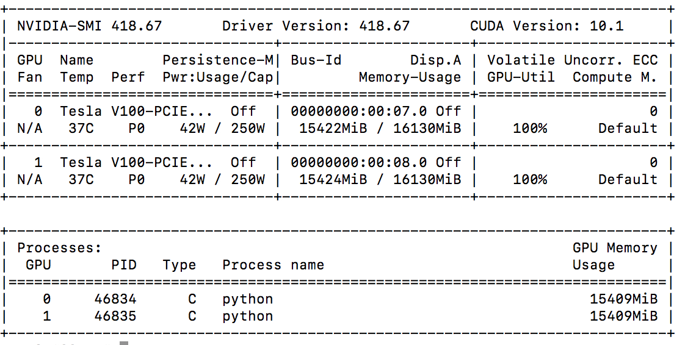
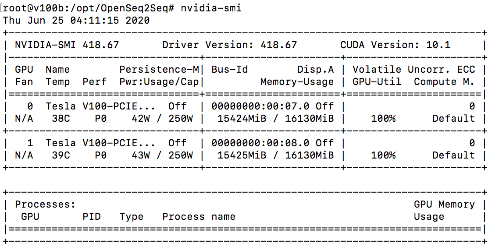
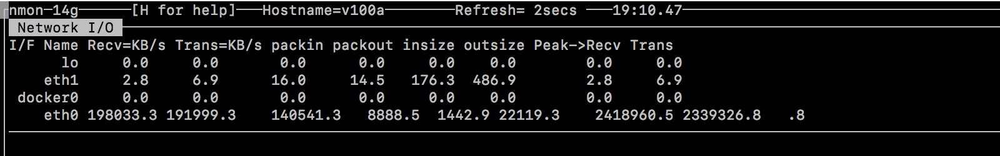

Neha Kumar  
MIDS W251 Section 1

1. How long does it take to complete the training run?  
A: The training run takes 24 hours to complete, with about 1.6 seconds per step
2. Do you think your model is fully trained? How can you tell?  
A: 
3. Were you overfitting?  
A: 
4. Were your GPUs fully utilized?  
A: Yes, according to the nvidia-smi output, both GPUs on both VMs (4 total) were 100% utilized

5. Did you monitor network traffic (hint: apt install nmon)? Was network the bottleneck?  
A: The network speed is about 200k KB/s. The network is able to pass through up to 1 gbps. Therefore, the network is not being fully utilized so it is not the bottleneck

6. Take a look at the plot of the learning rate and then check the config file. Can you explan this setting?  
A: The learning rate goes up linearly up to the 8000th step (this is the warm-up rate) and then decreases proportionally to the inverse square root (following the Adam optimizer scheme) as outlined in the paper [here](https://arxiv.org/pdf/1706.03762.pdf). We can see the number of warm up steps called out in the warmup_steps under the lr_policy_param. Additionally, the lr_policy is set to transformer_policy, aligning with the referenced paper.
7. How big was your training set (mb)? How many training lines did it contain?  
A: The training set is 1256 MB, 9049736 total lines (4524868 lines in each language)
8. What are the files that a TF checkpoint is comprised of?  
A: 
9. How big is your resulting model checkpoint (mb)?  
A:
10. Remember the definition of a "step". How long did an average step take?  
A: On average, each step took about 1.6 seconds
11. How does that correlate with the observed network utilization between nodes?  
A: 
